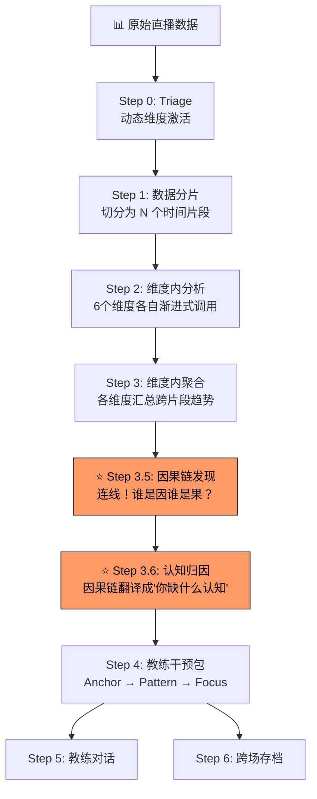
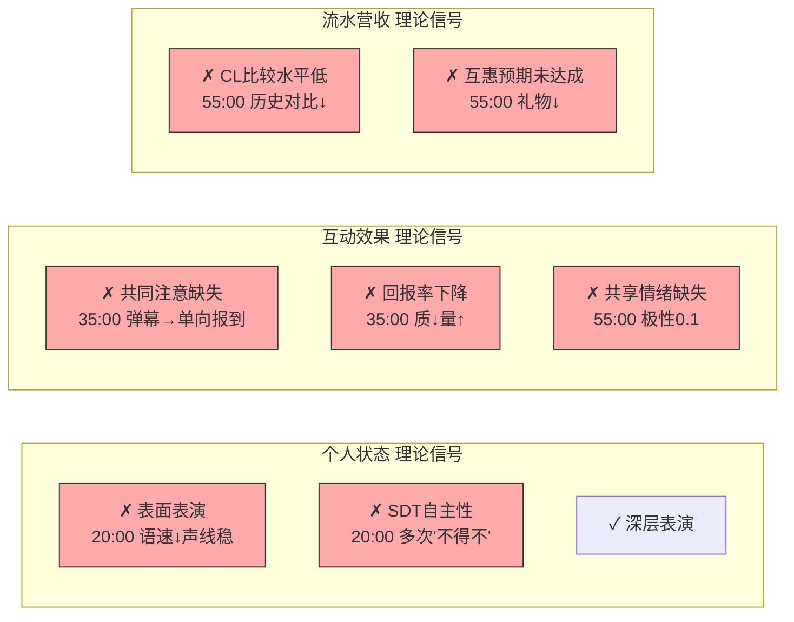
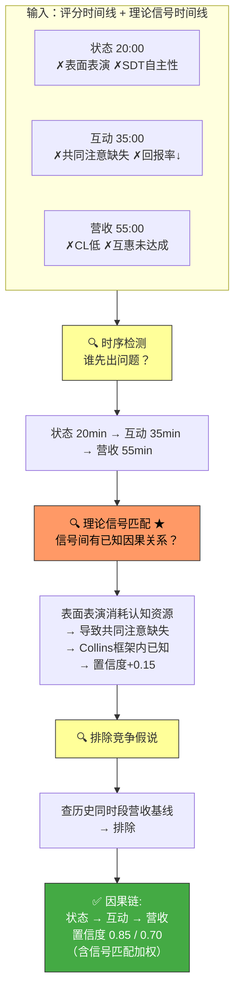
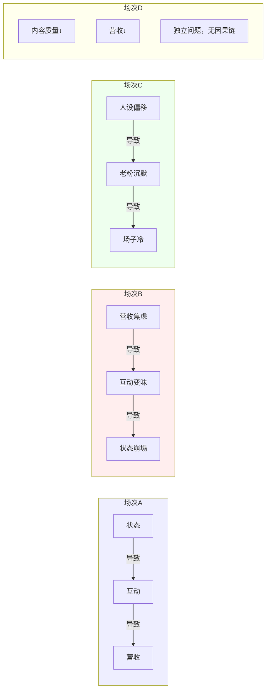
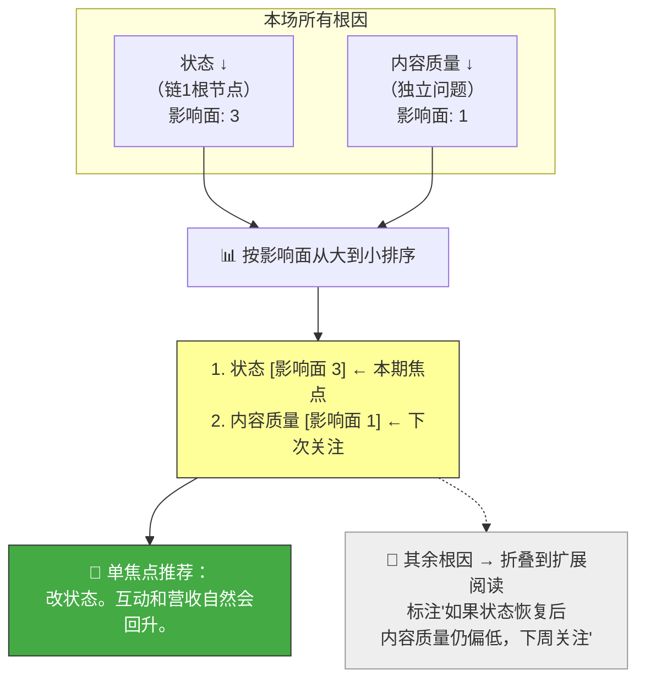
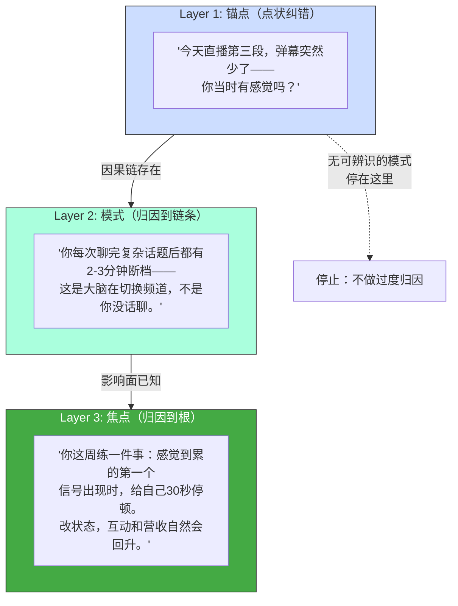

# v2 架构流程图

## 一、整体流程（宏观）



## 二、因果链发现详细过程（Step 3.5）

### 1. 理论信号矩阵（Step 2 产出）

> 每个维度不是只给一个评分——同时输出每个理论概念的匹配状态（✓/✗/—）



### 2. 因果链推断（评分 + 信号双层验证）



## 三、因果方向不固定——每场重新判断



## 四、影响面计算与单焦点推荐（Step 3.5 收尾）

> 根因可以有多个。按影响面排序。教练只推一个焦点。



## 五、教练输出三层递进



## 六、一句话总结

```
旧架构：六个医生各看一个科室，给你六张化验单。
         ↓
  Step 3.5：一个全科医生把所有化验单放在桌上，
           画了一张因果图。
           发现可能不止一个病根。
         ↓
  影响面计算：哪个病根牵连的科室最多？
         ↓
  单焦点推荐：这次只治影响面最大的那个。
              其他的下次再说。
         ↓
  Step 4：给你一个你能照着做的练习，而不是一张评分表。
```
